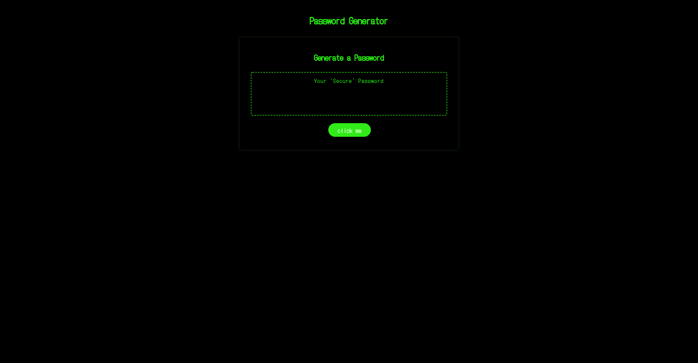

# 03 JavaScript: Password Generator

## 

My goal this week was to create a working password generator from supplied code. The code I was given gave all the HTML/CSS required with a few JavaScript elements to get started. Most of my work was done in JavaScript. I did change some elements in my HTML (the button title and placeholder text), I also changed the color profile of site in CSS to emulate an old school terminal. I used the concat/ random number method for my generator which although not entirely secure was within my grasp.
## User Story

```
AS AN employee with access to sensitive data
I WANT to randomly generate a password that meets certain criteria
SO THAT I can create a strong password that provides greater security
```

## Acceptance Criteria

```
GIVEN I need a new, secure password
WHEN I click the button to generate a password
THEN I am presented with a series of prompts for password criteria
WHEN prompted for password criteria
THEN I select which criteria to include in the password
WHEN prompted for the length of the password
THEN I choose a length of at least 8 characters and no more than 128 characters
WHEN prompted for character types to include in the password
THEN I choose lowercase, uppercase, numeric, and/or special characters
WHEN I answer each prompt
THEN my input should be validated and at least one character type should be selected
WHEN all prompts are answered
THEN a password is generated that matches the selected criteria
WHEN the password is generated
THEN the password is either displayed in an alert or written to the page
```
## My Generator

https://zchalk.github.io/Password_Generator/



